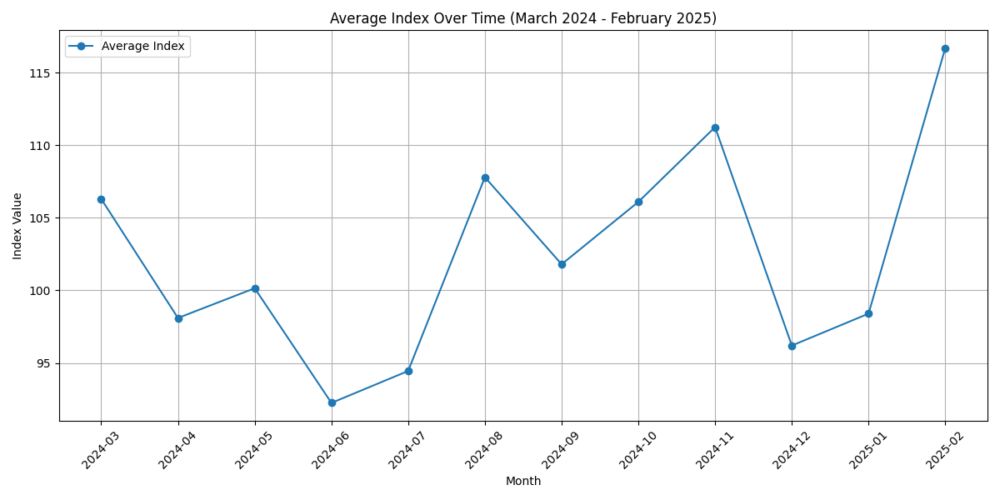

# GitHub Actions Testing

## Monthly Index

## Weights

| Metric | Weight |
|--------|--------|
| mariadborg_downloads | 50 |
| debian_popcon | 50 |

## Monthly values for past 12 months

| Metric | 2024-01 | 2024-03 | 2024-04 | 2024-05 | 2024-06 | 2024-07 | 2024-08 | 2024-09 | 2024-10 | 2024-11 | 2024-12 | 2025-01 | 2025-02 |
|--------|---------|---------|---------|---------|---------|---------|---------|---------|---------|---------|---------|---------|---------|
| mariadborg_downloads | 71,617 | 79,039 | 74,552 | 75,840 | 69,828 | 72,452 | 91,304 | 85,491 | 90,238 | 101,014 | 78,550 | 82,015 | 116,526 |
| debian_popcon | 400,955 | 409,699 | 369,290 | 378,631 | 348,928 | 351,505 | 353,434 | 337,494 | 345,524 | 326,865 | 331,569 | 329,985 | 283,411 |
