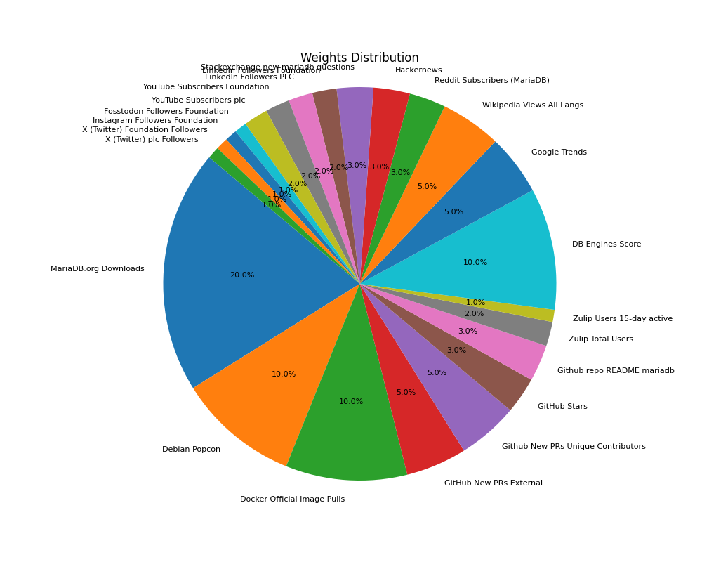
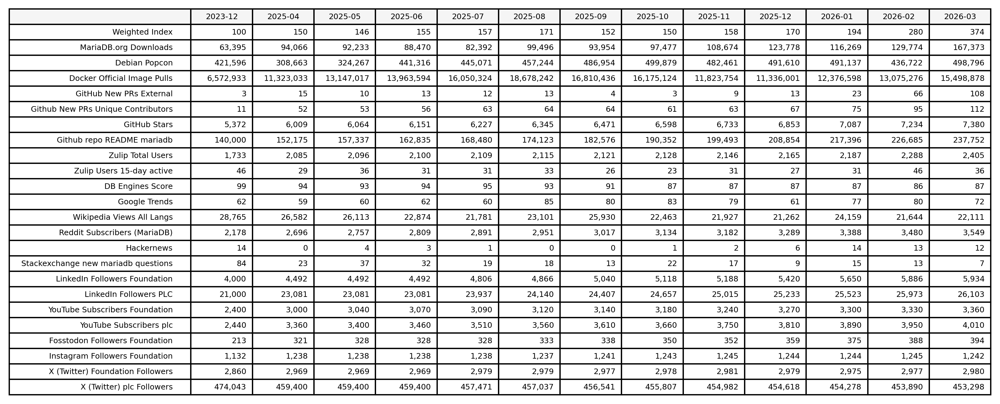

# MariaDB Adoption Index (beta)

## Monthly Weighted Index (baseline 2024-01)

## Index Weights

## Rolling 12 month values and baseline (2024-01)

Baseline 2024-01-01 in practise values for month of 2023-12.

# Documentation

## Updating the Adoption Index with Monthly values

The Adoption Index is a weighted average of chosen metrics depciting MariaDB's adoption. The baseline "100" index value is 2024-01.

To create the adoption index for the latest month, run the script in [index/create_index.py](index/create_index.py). It will use monthly data stored in '''monthly.csv''' files in the '''data''' folder, and weights defined in [index/create_index_weights.csv](index/create_index_weights.csv).

## Automation to fetch data

The source data that the adoption index is based on, are monthly values in the '''data''' folder. 

The data is fetched manually, or automatically with Github Actions (see .github/workflows/) on a daily or monthly. The automation may be a curl command, and python script in the data folder's fetch.py file, or an explanation in a fetch.md file explaining how to manually update the data. To see an overview of when thethe current Github Actions are run, see [scripts/workflow_schedules.csv](scripts/workflow_schedules.csv) generated by [scripts/workflow_schedules.py](scripts/workflow_schedules.py).

Data that is fetched on a daily basis is stored in a '''daily.csv''' file. It is converted to a monthly format '''monthly.csv''' by a Github Actions using the scripts in [daily2monthly.py](scripts/daily2monthly.py) or [delta2monthly.py](scripts/delta2monthly.py).

The table below shows how a particular source is updated. "key" means the source is not public and requires an API-key to access. The API-keys are stored as secrets in the Github Repo for the Github Actions to use. The "create monthly" shows what is used to create the monthly value.

| KPI                                    | Fetch Method          | Key  | Create Monthly    |
|----------------------------------------|-----------------------|------|-------------------|
| mariadb.org downloads                  | curl, historic        |      | raw2monthly.py    |
| Debien popcon                          | curl, historic        |      | raw2monthly.py    |
| Docker official image pulls            | curl, daily           |      | wip               |
| Github new PRs external                | fetch.py, historic    | key  | latest2monthly.py |
| Github new PRs ext. unique user names  | fetch.py, historic    | key  | latest2monthly.py |
| Github stars                           | curl, daily           |      | daily2monthly.py  |
| Github readme repos                    | curl, daily           |      | daily2monthly.py  |
| Zulip total users                      | curl, daily           | key  | daily2monthly.py  |
| Zulip active users 15d                 | curl, daily           | key  | daily2monthly.py  |
| DB-engines                             | curl scrape, daily    |      | daily2monthly.py  |
| Google trends                          | fetch.py, historic    |      | fetch.py          |
| Wikipedia views all langs              | fetch.py, historic    |      | fetch.py          |
| Reddit subscribers                     | fetch.py, daily       | key  | daily2monthly.py  |
| Hackernews                             | fetch.py, historic    |      | fetch.py          |
| Stackexchange new questions            | fetch.py, historic    |      | fetch.py          |
| LinkedIn                               | manual                |      | wip               |
| Youtube                                | curl, daily           | key  | daily2monthly.py  |
| Fosstadon                              | manual                |      | wip               |
| Instagram                              | manual                |      | wip               |
| X (Twitter)                            | manual                |      | wip               |

### API-Key docs
* [Github fine-grained personal access tokens](https://github.blog/security/application-security/introducing-fine-grained-personal-access-tokens-for-github/)
* [Zulip API keys](https://zulip.com/api/api-keys)
* [Reddit Developer Token](https://developers.reddit.com/docs/authentication)
* [Youtube Data API](https://developers.google.com/youtube/registering_an_application)
* LinkedIn
* X

## Misc

Cursor and Claude have been used to generate this solution. 
