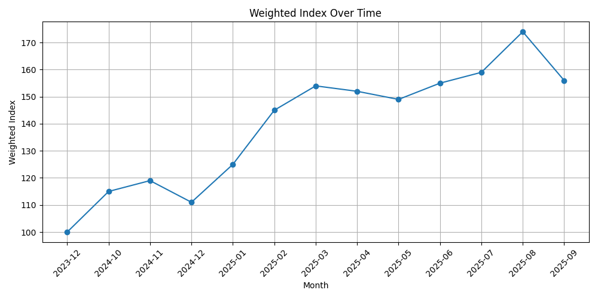
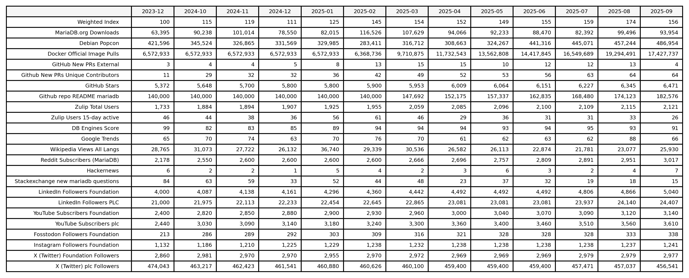

# MariaDB Adoption Index (beta)

## Monthly Weighted Index (baseline 2024-01)

## Index Weights

## Rolling 12 month values and baseline (2024-01)

# Documentation

The MariaDB weighted index is calculated in [create_index.py](index/create_index.py) using prepared monthly values. A monthly index value for each value by using 2024-01 as the baseline. A single weighted summary index value per month is calculated as defined in [create_index_weights.csv](index/create_index_weights.csv).

The source data is fetched either with automation from their original sources (see .github/workflows/) or added manually by the MariaDB Foundation. Raw fetched data is converted to monthly values in _monthly.csv files. 

Cursor and Claude have been used to generate this solution. 

## KPI details

| KPI                                    | Data Source Fetch      | Create Monthly |
|----------------------------------------|------------------------|----------------|
| mariadb.org downloads                  | curl, historic         | python         |
| Debien popcon                          | curl, historic         | python         |
| Docker official image pulls            | curl, daily            | python         |
| Github new PRs external                | python, historic, key  | python         |
| Github new PRs ext. unique user names  | python, historic, key  | python         |
| Github stars                           | curl, daily            | python, todo   |
| Github readme repos                    | curl, daily            | python, todo   |
| Zulip total users                      | curl, daily, key       | python, todo   |
| Zulip active users 15d                 | curl, daily, key       | python, todo   |
| DB-engines                             | curl, daily, scrape    | python, todo   |
| Google trends                          | python, historic       | -              |
| Wikipedia views all langs              | python, historic       | -              |
| Reddit subscribers                     | curl, daily, key       | python, todo   |
| Hackernews                             | python, historic, key  | with fetch     |
| Stackexchange new questions            | python, historic       | with fetch     |
| LinkedIn                               | manual                 | -              |
| Youtube                                | python, daily, key     | python, todo   |
| Fosstadon                              | manual                 | -              |
| Instagram                              | python, broken         | python, todo   |
| X (Twitter)                            | manual                 | -              |